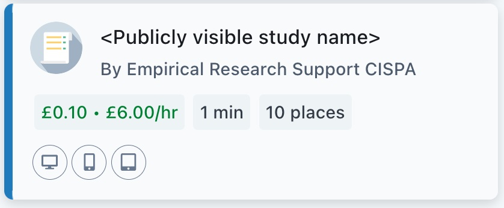
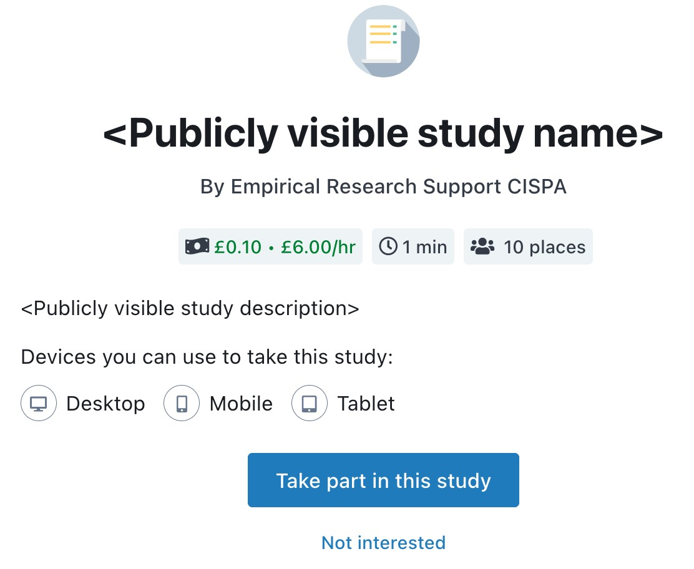

```{r, include = FALSE, cache = FALSE, eval = TRUE}
knitr::read_chunk(
	"_R_setup.R"
)
```{r, r_setup, eval = TRUE, include = FALSE, echo = FALSE}
```


# Introduction

The `prolific.api` package provides an interface for creating and managing empirical crowd-sourcing studies
on [prolific.co](https://www.prolific.co/) from `R`.

A number of prescreening characteristics can be used to recruit specific groups of 
participants for a study on [prolific.co](https://www.prolific.co/).
Especially when these prescreeners are used for splitting up a total sample size into 
different relevant groups, an increasing number of parallel studies
have to be created and managed.
`prolific.api` serves as an interface for doing this in a (semi-)automatic manner from `R`,
e.g. by using a common study template and changing only a few parameters between studies.


***Note:***
An
[API token](https://docs.prolific.co/docs/api-docs/public/#section/Authentication) 
is required for accessing the API of 
[prolific.co](https://www.prolific.co/). 
For more details, see the *[section on obtaining an API token](#get-token)*.


# Core Functionalities

The main functionalities in the `prolific.api` package are provided in three
`ReferenceClasses`:

| Class                  | Functionality                                         |
| :--------------------- | :---------------------------------------------------- |
| `api_access`           | - Access the API<br>- Submit and retrieve information |
| `prolific_study`       | - Set up and modify studies                           |
| `prolific_prescreener` | - Define the group of eligible participants           |

**In general, all fields and methods of these classes are available in 
a `RefClass` as well as `S4` object style (see the 
*[section on methods and fields access](#styles)*
 ).**
The core functionalities are summarized below.

## Submitting and retrieving information: The `api_access` class

The `api_access` class is designed for interacting with 
[Prolific's API](https://docs.prolific.co/docs/api-docs/public/).
The central method to achieve this is `access`, which can be used
to exchange (retrieve and submit) information with the API.

### Setting up an `api_access`


An `api_access` object can be created by 


```r
prolific_api_access <- api_access(api_token = "<api_token>")
```
While all other settings when creating an `api_access` rarely require adjustment,
the `api_token` is the information that **needs to be specified** for the API access to work.
The `prolific.api` package's functionality heavily depends on a a valid `api_token`.
Therefore, the above command prints a console message to indicate that the token is valid:

The token's validity can also be checked by means of the `check_authorization` method, which
returns `TRUE` if the token is valid, and `FALSE` if it is not:

```r
prolific_api_access$check_authorization()
#> [1] TRUE
```

The 
*[section on obtaining an API token](#get-token)* 
describes how to obtain a valid token.

### Using an `api_access` 

The actual API access is carried out by means of the `access` method of the `api_access` class.
The 
`access`
method wraps different methods for exchanging information with the API that serve different purposes:


| Method   | Functionality                                 |
| :------- | :-------------------------------------------- |
| `get`    | Retrieving endpoint / data                    |
| `post`   | Create an endpoint / send data                |
| `patch`  | Apply changes to an endpoint                  |
| `put`    | Replace an endpoint with new data             |
| `delete` | Delete an endpoint                            |

This table lists the available methods, which are specified in the `method` 
argument of the `access` method.
By default, file transfer is based on [curl](https://curl.se/).

For retrieving information from [prolific.co](https://www.prolific.co/) using the `get` method,
a simple example is


```r
prolific_api_access$access(
  method = "get",
  endpoint = "users/me"
)
```
to obtain information about the account you are accessing the API with.


A simple example for submitting information to the API using the `post` method is


```r
prolific_api_access$access(
  endpoint = "study-cost-calculator",
  method = "post",
  data = list(
    reward = 100,
    total_available_places = 5
  )
)
```

to calculate the cost  (including fees and taxes)  of a study where `5` participants are paid `1` £ each.

More realistic examples are provided in the sections below, while 
a list of further endpoints is provided in  
<!-- the [vignette on Prolific's API endpoints](prolificapi-endpoint.html)
as well as  -->
[Prolific's API documentation](https://docs.prolific.co/docs/api-docs/public).

## Set-up and change studies: The `prolific_study` class

The `prolific_study` class provides a lightweight interface for
creating, managing and modifying studies on [prolific.co](https://www.prolific.co/) using `R`.
There are a lot of options to be chosen from when setting up such a study, but let's start with a simple example.

### Creating a `prolific_study`

A minimal specification for creating a `prolific_study` contains the following information:


```r
new_study <- prolific_study(
  # Information shown to participants
  name = "<Publicly visible study name>",
  description = "<Publicly visible study description>",
  estimated_completion_time = 1,
  reward = 10,
  # URL participants are redirected to
  external_study_url = "https://www.link_to_my_study.com",
  # Completion code to verify participation
  completion_code = "123",
  # Number of participants to recruit
  total_available_places = 10,
  eligibility_requirements =
    list(
      participant_id_prescreener
    )
)
```


The information that is presented to the potential participants 
contains the study's 

- **name**,
- **description**,
- **estimated completion time**,
- **reward** and
- **total available places**.

To them, the study will then will be presented as



in the dashboard. Once they select the study in the dashboard, more details are shown:




People deciding to take part in a study can click on "Take part in this study", which redirects them
to the

- **external study url**

where the study is conducted.
Once they completed your study, you should provide them with a

- **completion code** 

and redirect them back to [prolific.co](https://www.prolific.co/).
Participant compensation is then based on the completion code by checking
whether a participant obtained the correct completion code
after completing the study. The compensation does not happen automatically, so you still can check which participants are compensated, e.g. in case of erroneous completion codes.

The above fields are the ones that need to be set in a minimal study specification.
For an exhaustive overview of the fields in a  `prolific_study`, see the
*[section on methods and fields access](#styles)*
and the documentation `help(prolific_study)`.   

<!-- #### Validity-Check for a `prolific_study`

The arguments for constructing `new_study` above are the ones that need to be specified for a study to be 
created on [prolific.co](https://www.prolific.co/). To make sure that all necessary fields of a `prolific_study`
have been set, the `validity_check` method can be used.
In case a study has all required information, it simply returns `TRUE`:


```r
validity_check(new_study)
#> standardGeneric("validity_check")
```

In cases where a study lacks some of the information, it returns a message that guides through the required steps:


```r
new_study_without_information <- prolific_study()
validity_check(new_study_without_information)
#> standardGeneric("validity_check")
```

(note that the `estimated_completion_time`, `reward` and `total_available_places` 
are not mentioned in this message because they have default values of `1`). -->

#### Posting a `prolific_study` on the platform

After creating or changing a `prolific_study` in `R`,
the study can be submitted to  [prolific.co](https://www.prolific.co/) 
to represent it on the platform.


To submit the `new_study` created above to the Prolific platform,
we use 


```r
prolific_api_access$access(
  endpoint = "studies",
  method = "post",
  data = new_study
)
#> ======================================================================
#> Prolific study summary:
#> ======================================================================
#> name:                      <Publicly visible study name>
#> internal_name:             
#> id:                        634e9b49674d6e362b157001
#> project:                   61f12ae112c02bba9e3523b1
#> external_study_url:        https://www.link_to_my_study.com
#> total_available_places:    10
#> reward:                    10
#> ======================================================================
```

The output shows that the study has been assigned an `id` (`"634e9b49674d6e362b157001"` in this case).
This `id` is determined by [prolific.co](https://www.prolific.co/), 
and the unique identifier for the study on the platform.
You can now also find the study in the webinterface.


### Getting a `prolific_study` from the platform

The study's `id` is also required if you want to obtain a previously created study from [prolific.co](https://www.prolific.co/).
For a study that is not yet represented in an R object, we first need to find out its id.

A list of *all* studies in the Prolific account can be obtained via


```r
# If the study ID is unknown, you can obtain a list of all studies:
list_of_studies <-
  prolific_api_access$access(
    endpoint = "studies",
    method = "get"
  )
```


which  in this case includes only the new study created above:


```r
print(list_of_studies)
#>    creation_day creation_time internal_name
#> 1:   2022-10-18      12:25:45              
#>                             name                       id study_type
#> 1: <Publicly visible study name> 634e9b49674d6e362b157001     SINGLE
#>    total_available_places places_taken reward      status
#> 1:                     10            0     10 UNPUBLISHED
#>    number_of_submissions total_cost stratum privacy_notice
#> 1:                     0      139.9      NA             NA
```


To retrieve the study from the API, we use
the
study's endpoint, which is 
`"studies/634e9b49674d6e362b157001"`:


```r
# Obtain the study with ID 634e9b49674d6e362b157001 from Prolific
obtained_study <- 
	prolific_api_access$access(
		endpoint = c("studies","634e9b49674d6e362b157001"),
		method = "get"
)
```
Note that the `endpoint` argument may be a vector, which is then collapsed using `/`.


### Updating Fields in a `prolific_study`  {#studies_fields_update}

The fields in a `prolific_study` can be changed using either `S4` and `RefClass` syntax
(see the 
*[section on methods and fields access](#styles)*
).
For example, you can change the name of `new_study` using either one:


```r
# S4 class style
name(new_study) <- "How to create and update studies on Prolific"
# Refclass style
new_study$name <- "How to create and update studies on Prolific"
```

Both lines of code have the same effect: The `name` of `new_study` is now "How to create and update studies on Prolific".
Equivalent access works for all other fields in `prolific_study` objects, 
which are listed in the
*[section on methods and fields access](#styles)*
and the documentation `help(prolific_study)`.


### Changing a `prolific_study` on the platform {#studies_patch}

To actually apply the changes made in the previous paragraph to the study on 
[prolific.co](https://www.prolific.co/),
`prolific_api_access$access` with `method = "patch"` or `method = "put"` is used:


```r
# Patch new_study on Prolific
prolific_api_access$access(
	endpoint = c("studies",new_study$id),
	method = "patch",
	data = 
)
#> ======================================================================
#> Prolific study summary:
#> ======================================================================
#> name:                      <Publicly visible study name>
#> internal_name:             
#> id:                        634e9b49674d6e362b157001
#> project:                   61f12ae112c02bba9e3523b1
#> external_study_url:        https://www.link_to_my_study.com
#> total_available_places:    10
#> reward:                    10
#> ======================================================================
```

`method = "patch"` applies all changes made to the study
while retaining the settings that are unchanged.
In contrast, `method = "put"` 
can be used to
overwrite an existing study with an entirely new study specification.
In many cases, the effect will be the same - but empty fields in a `prolific_study` will not be changed 
when using `"patch"`, but will be deleted when using `"put"`.


### Deleting a `prolific_study` on the platform
Ultimately, a study can be deleted using `access` with `method = "delete"` on the study's endpoint


```r
# Delete new_study on Prolific
prolific_api_access$access(
	endpoint = c("studies",new_study$id),
	method = "delete"
)
```

## Defining eligible participants: The `prolific_prescreener` class 


`prolific_prescreener` objects are used for characterizing the participants to be selected.
In that sense, they contain a description of the person's to be recruited in a `prolific_study`.
Various characteristics are available to define this target group. An exhaustive list is provided in the
[list of available prescreeners](#prescreener-list).

### Setting up `prolific_prescreeners`

To make a simple example, participants who currently live in the United States can be selected using the `prolific_prescreener`


```r
us_prescreener <-
  prolific_prescreener(
    title = "Current Country of Residence",
    "United States"
  )
```

You can combine multiple constraints for a single prescreener. 
To extend the above prescreener to also allow for participants from the UK, use


```r
uk_us_prescreener <-
  prolific_prescreener(
    title = "Current Country of Residence",
    "United Kingdom",
    "United States"
  )
```

Some of the prescreeners allow to specify lower and upper boundaries for a numerical variable.
For example, participants with an age between `20` and `24` can be selected using the `prolific_prescreener`


```r
age_prescreener <-
  prolific_prescreener(
    title = "Age",
    "Minimum Age" = 20,
    "Maximum Age" = 24
  )
```
### Using `prolific_prescreeners`

The prescreeners can be combined in a list and included as the 
`eligibility_requirements` field of a `prolific_study`: 


```r
new_study_with_prescreeners <- prolific_study(
  # Information shown to participants
  name = "<Publicly visible study name>",
  description = "<Publicly visible study description>",
  estimated_completion_time = 1,
  reward = 10,
  # URL participants are redirected to
  external_study_url = "https://www.link_to_my_study.com",
  # Completion code to verify participation
  completion_code = "123",
  # Number of participants to recruit
  total_available_places = 10,
  # Constraints that participants have to meet
  eligibility_requirements = list(
    uk_us_prescreener,
    age_prescreener
  )
)
```

This example creates a study that has the same information as `new_study` above, but is available only for
persons living in the UK or US who are between `20` and `24` years of age.

As above, the study can be submitted to [prolific.co](https://www.prolific.co/) using


```r
prolific_api_access$access(
  endpoint = "studies",
  method = "post",
  data = new_study_with_prescreeners
)
```

To add, remove or change prescreeners in an existing `prolific_study`, simply  
modify the
study's `eligibility_requirements` field, as described
(see the 
*[section on updating fields in a `prolific_study`](#studies_fields_update)*
).
For example, the age requirement specified for `new_study_with_prescreeners` can be relaxed to allow for
participants between the ages of `18` and `28`:

```r
new_study_with_prescreeners$eligibility_requirements$
  `Age`$constraints <- list(
  "Minimum Age" = 18,
  "Maximum Age" = 28
)
```
To limit the study to persons living in the US (i.e. exclude the previously included UK inhabitants), use

```r
new_study_with_prescreeners$eligibility_requirements$
  `Current Country of Residence` <- us_prescreener
```
The changes can be applied as described in the 
*[section on changing a `prolific_study` on the platform](#studies_patch)*


**A full searchable list of all currently available prescreeners (as of 2022-10-18)
is available in the following
[list of available prescreeners](#prescreener-list).
It also includes example code snippets for each prescreener and available constraints.
**


# List of available  `prolific_prescreeners` {#prescreener-list}

The following table contains **all** currently (as of 2022-10-18) available prescreeners.
The `prescreener title` is to be used in the `title` field of a `prolific_prescreener` object.

***Click on the respective row to show all available constraints ***

***Click on the respective constraint to show R-code for setting up the prescreener***


```{r, include = FALSE, cache = FALSE, eval = TRUE}
knitr::read_chunk(
	"_list_prescreeners.R"
)
```{r, list_of_prescreeners_reactable, eval = TRUE, include = TRUE, echo = FALSE}
```


# Methods and fields -- `RefClass` and `S4` syntax overview {#styles}
All fields and methods in the `prolific.api` package are available in
a `RefClass` as well as `S4` syntax style.
For example, the `api_token` of an `api_access` object can be accessed by


```r
prolific_api_access$api_token
#> [1] "<api_token>"
```
as well as

```r
api_token(prolific_api_access)
#> [1] "<api_token>"
```
Both options are equivalent and can be used for assignment:

```r
prolific_api_access$api_token <- "<new_api_token>"
#> API token status: invalid
#> 	 API access failed!
```
does the same as

```r
api_token(prolific_api_access) <- "<new_api_token>"
#> API token status: invalid
#> 	 API access failed!
```
and the console messages indicate that `"<new_api_token>"` is not valid for authentication.
All fields in `prolific.api` classes can be assigned in a corresponding manner.
An overview of all fields and methods together with corresponding `RefClass` and `S4` code snippets is provided in the following list:


```{r, include = FALSE, cache = FALSE, eval = TRUE}
knitr::read_chunk(
	"_list_fields_methods.R"
)
```{r, list_fields_methods_reactable, eval = TRUE, include = TRUE, echo = FALSE}
```


# Obtaining an API token {#get-token}

The `prolific.api` package requires 
an 
[API token](https://docs.prolific.co/docs/api-docs/public/#section/Authentication) 
for accessing the 
[API](https://docs.prolific.co/docs/api-docs/public)
of 
[prolific.co](https://www.prolific.co/).
To get such a token, you first need a researcher account on 
[prolific.co](https://www.prolific.co/).
When logging in to this account, you can obtain the 
<!-- *workspace-specific*  -->
token
<!-- by selecting the workspace you would like to work in, 
for which 
the tokens can be managed  -->
in the `Settings -> Go to API token page` menu.


```{r, include = FALSE, cache = FALSE, eval = TRUE}
knitr::read_chunk(
	"_R_setup.R"
)
```{r, r_restore, eval = TRUE, include = FALSE, echo = FALSE}
```
